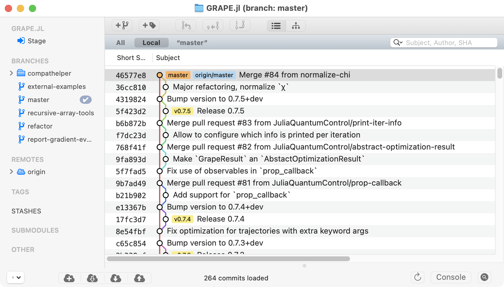

# `git merge-pr`

A `git merge-pr` command to merge GitHub PRs from the command line.

# Introduction

The `git-merge-pr` Python script in this repository encapsulates the following principles for merging [GitHub pull requests](https://docs.github.com/en/pull-requests/collaborating-with-pull-requests/proposing-changes-to-your-work-with-pull-requests/about-pull-requests) (PRs):

* PRs must be [rebased](https://git-scm.com/book/en/v2/Git-Branching-Rebasing) on the latest `master` before they can be merged.
* PRs can contain multiple commits, but those commits should be reasonably clean and atomic. Otherwise, the PR should be [squashed into a single commit](https://stackoverflow.com/questions/5189560/how-do-i-squash-my-last-n-commits-together) before merging.
* PRs should be merged with an explicit merge commit that references the PR number and original branch name.
* [Fast-forward](https://docs.github.com/en/pull-requests/collaborating-with-pull-requests/incorporating-changes-from-a-pull-request/about-pull-request-merges#rebase-and-merge-your-commits) or [squash merges](https://docs.github.com/en/pull-requests/collaborating-with-pull-requests/incorporating-changes-from-a-pull-request/about-pull-request-merges#squash-and-merge-your-commits) are generally not acceptable. Note that squash-merging (which does not create a merge commit) is not the same as squashing the PR branch into a single commit before merging.
* Small fixes, like code formatting or version-bumping, can be performed as part of the merge commit.

This strategy will result in a particularly clean commit graph, like this one:




# Prerequisites

* [Python 3](https://www.python.org) (`/usr/bin/env python3`)
* [Git](https://git-scm.com) (`git`)
* [GitHub Command Line Utility](https://cli.github.com) (`gh`)


# Installation

Copy (or symlink) the [`git-merge-pr`](https://github.com/goerz/git-merge-pr/raw/refs/heads/master/git-merge-pr) script to a folder on your `$PATH`, e.g., `~/bin/`. Make sure it has executable permissions:

```
wget -o ~/bin/git-merge-pr https://github.com/goerz/git-merge-pr/raw/refs/heads/master/git-merge-pr
chmod a+x ~/bin/git-merge-pr
```

If you do not understand what the above instructions mean, this script is not for you.


# Usage

If installed correctly, the script can be called as a subcommand of `git`. See `git merge-pr -h` for details:

```
usage: git merge-pr [-h] [--no-check-base-branch] [--no-require-rebased]
                    PR [BRANCH ...]

Merge a GitHub pull request from the command line.

positional arguments:
  PR                    Pull request number
  BRANCH                Local branch name tracking the PR. If not given,
                        automatically determined via `gh pr checkout PR`

options:
  -h, --help            show this help message and exit
  --no-check-base-branch
                        Skip checking and updating the base (current) branch
  --no-require-rebased  Do not require BRANCH to be rebased on the base
                        (current) branch

Additional arguments (...) must be separated from the preceding arguments by
`--` and are forwarded to `git merge`. Useful options might include `--no-
edit`, `--no-commit`, or `--ff`. By default, merging is always done with a
merge commit.
```

Note that the script will not push the merge, and that the PR on GitHub thus will stay open until the next `git push`. It is strongly recommended to set up GitHub to [automatically delete branches](https://docs.github.com/en/repositories/configuring-branches-and-merges-in-your-repository/configuring-pull-request-merges/managing-the-automatic-deletion-of-branches) when PRs are closed.


# Tips and Tricks

### Merging into a branch other than `master`/`main`

The script assumes that the base branch is `master` or `main`. The `--no-check-base-branch` flag can be used to merge into any other currently checked-out branch. Note that the script ensures that `master`/`main` is up-to-date (updating if necessary and possible), but no such check is performed with `--no-check-base-branch`.


### Merging without `rebase`

Sometimes, rebasing a long-running branch on the current master is not feasible, as it would involve too many conflicts. Giving the `--no-require-rebased` flag allows for a merge when there have been commits on `master` after the commit that the PR was based on. Note that this will result in a less clean history, in particular if this kind of merge is done with multiple PRs. On the other hand, some people would argue that it is the right thing to do, as it more accurately represents the actual development history.


### Applying version bumps and other small fixes

Sometimes a PR will forget to set the version appropriately, not have a CHANGELOG entry, or require other small fixes. It may be easier for the maintainer to make these fixes themselves rather than requesting changes from the PR author. It is reasonable to make such changes in the merge commit. To do this, at the end of the `git merge-pr` command, put a `--` separator and specify a `--no-commit` flag that gets forwarded to `git merge`. The repository will be left in a `MERGING` state, allowing for further edits. These edits must be added with `git add`, and then `git commit` will conclude the merge.

Alternatively, the merge can be done normally. Before pushing, make the required changes, then commit them with the `--amend` flag. Only then push the result.


### Merging release PRs

I believe that only the commit tagged as a particular release should contain a version `x.y.z`. [All other releases should have a `+dev` or `-dev` suffix](https://michaelgoerz.net/notes/inter-release-versioning-recommendations.html). One way to ensure this is to make a `release-x.y.z` branch and PR where the version number is bumped, the release notes are added, etc. If the release passes CI, it is tagged on that branch. When merging the release back into `master`, the version must be bumped again to include the `+dev` suffix. This can be done by calling `git merge-pr` with `--no-commit`, [as above](#applying-version-bumps-and-other-small-fixes).
